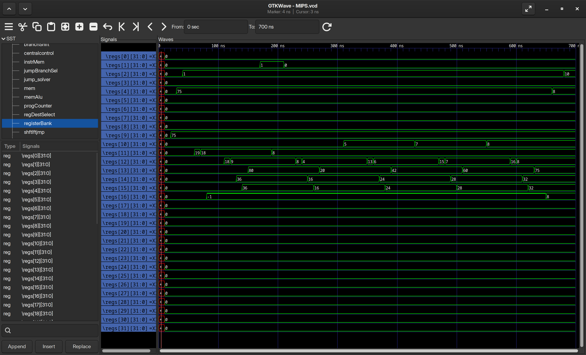

# PROJETO 2 - DESCRIÇÃO DE PROCESSADOR MIPS EM VERILOG
### COMP0415 - ARQUITETURA DE COMPUTADORES - T03

Este projeto teve como objetivo a implementação de um processador MIPS de ciclo único, bem como a execução de um algoritmo em MIPS Assembly neste processador.

## Especificações do projeto

Foram implementadas as instruções:

- Tipo R (incluindo SLL e SRL)
- Load Word e Store Word
- Jump
- Branch on Equal e Branch on Not Equal
- Addi

Com planos futuros de adicionar suporte ao Jump-and-Link, ao Jump-Return e as syscalls.

## Funcionamento

Para verificar o funcionamento e os sinais do processador e seus módulos utilizando o GTKWave, basta executar *makefile* utilizando
```sh
make
```

### Compilar e executar

Para compilar e executar apenas o testbench, basta utilizar

```sh
make comprun
```

### Executar arquivo compilado

Para executar o arquivo compilado, utilize

```sh
make run
```

### Visualizar arquivo

Para visualizar o arquivo compilado e executado no GTKWave, utilize

```sh
make view
```

### Excluir arquivos da compilação

Para limpar os arquivos da compilação:

```sh
make clean
```

## Algoritmo utilizado

O algoritmo utilizado foi a busca binária em sua versão iterativa, com o código do projeto anterior simplificado. Além da troca pela iteratividade, as alterações foram:

- Remoção de instruções _la_ (load adress), pois o Array é carregado no endereço 0 da memória de dados
- Remoção de strings
- Remoção de syscalls (discutido abaixo)
- Substituição explícita de _li_ por _addi_
- "Hardcoding" do valor a ser pesquisado na primeira instrução do programa
- Adição de uma instrução sw (store word) para guardar o valor na memória (e utilizar, efetivamente, todas as instruções implementadas no processador)

### Como modificar o valor a ser pesquisado

O array possui os seguintes valores:

```c
 [1,2,8,17,20,40,42,60,75,80,81,82,84,90,125,162,200,4096,8192]
```
Para modificar o valor a ser pesquisado no array, basta alterar o valor dos últimos 4 dígitos hexadecimais na primeira linha da memória de instrução. O valor padrão é 75.

### Remoção de syscalls

Pelo fato de existirem diversas chamadas de sistema, envolvendo captura de valores e impressão de strings, elas não foram implementadas nessa versão do projeto. Assim, para que o usuário acompanhe a execução do código, foram adicionados registradores de depuração no módulo registers.v, e por consequência em MIPS.v, para se obter os falores nesses dois registradores. 

Dessa forma, o testbench do processador imprime os valores do registrador A0 (de argumentos) caso ele seja alterado, e para a execução caso o valor em V0 seja 10, correspondente à chamada "exit" do MIPS.

Assim, os valores impressos por A0 são, em sequência
1. O valor a ser procurado
2. A posição do valor procurado ou -1 (valor não encontrado)

## Detalhes de organização

### ```sll``` e ```srl```

As instruções sll e srl foram implementadas com códigos de controle da ULA 1000 e 1001, pois não foi encontrada nenhuma padronização de organização relativa a essas instruções.

### ```beq``` e ```bne```

Para a implementação do bne, foi utilizado uma porta lógica XOR entre a saída _zero_ da ULA e o AND para ativar o MUX de Branch. A operação XOR é realizada entre essa saída da ULA e um novo sinal da unidade de controle intitulado _bne_, que é ativado caso a instrução seja essa.

## Testbench

O testbench do processador instancia um módulo do processador (MIPS.v), fornecendo os sinais de clock e reset. Ele captura os valores de A0 e V0, e imprime o valor em A0 a cada momento que ele é atualizado.

Primeiro, A0 exibe o valor 0, pois é inicializado. Depois, exibe o valor a ser procurado. Por último, exibe a posição no array. Quando o programa chega ao fim, a posição do valor procrurado é exibida.

O testbench exporta os valores de todos os sinais do módulo MIPS, e os valores na memória e nos registradores, para serem exibidos no GTKWave.

Ao executar o .vvp gerado, avisos relacionados aos arrays de memória e registradores são exibidos, mas isso não interfere com o funcionamento do testbench.

Por possuir valores alteráveis, o testbench não computa automaticamente se a posição do valor mostrado no processador corresponde à posição esperada. A verificação, portanto, é manual.


## GTKWave




O GTKWave permite a visualização dos sinais de entrada e saída em todos os módulos, bem como o valor nos registradores e na memória. PAra isso, basta selecionar "registerBank" e "mem" no visualizador, e incluir os valores de cada endereço na visualização em onda. Para melhor visualização, é sugerido que o formato de dados seja alterado para signed decimal.
